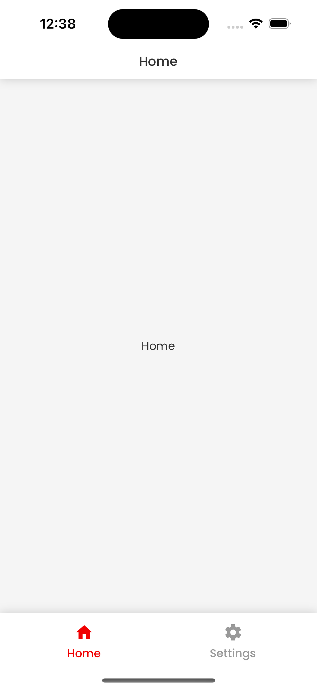
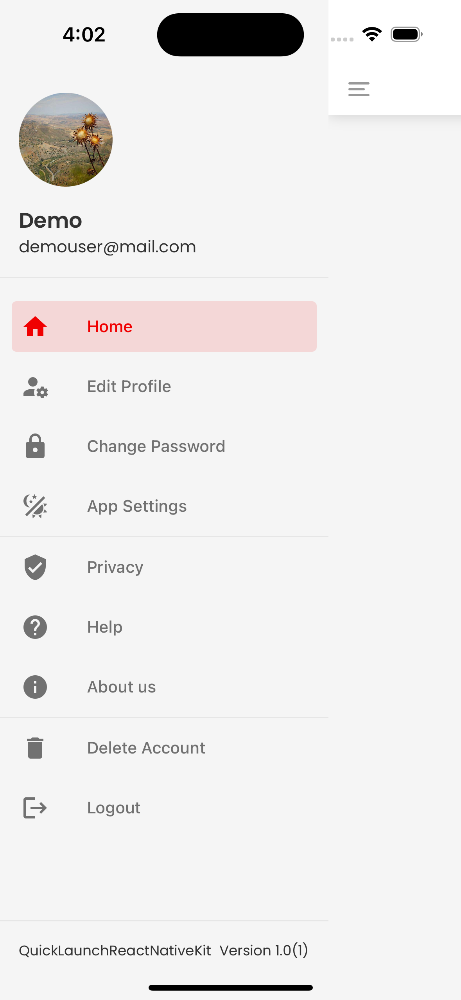

# Navigation

We use [React Navigation v6](https://reactnavigation.org/docs/getting-started/) in the current version of QuickLaunchReactNativeKit. You'll find any navigators in `./src/navigation`, with the `appNavigator.tsx` being the primary one.

There's also a `navigationUtilities.tsx` file which provides some utility functions we find useful in building apps, such as `getActiveRouteName`, `navigate` and `replaceLastNScreens`.

## Usage

To navigate between different screens, you can utilize the Navigation API as follows:

```tsx
navigation.navigate('settings');
```

## Primary Navigation Types

When setting up QuickLaunchReactNativeKit, you'll be prompted to choose between two primary navigation types: Tab or Drawer, depending on your app's structure.

### Option 1: Tab Navigation

Inside `./src/navigation/tabNavigator.tsx` you'll see the definition of the bottom tab navigator. This is where you can customize the style and behavior of the tab bar itself, along with each individual tab.

For detailed information, refer to the **[official documentation](https://reactnavigation.org/docs/bottom-tab-navigator/)**.

### Option 2: Drawer Navigation

Inside `./src/navigation/drawerNavigator.tsx` you'll see the definition of the Drawer navigator. This is where you can customize the style and behavior of the Drawer menu itself, along with DrawerItems.

For detailed information, refer to the **[official documentation](https://reactnavigation.org/docs/drawer-navigator)**

### Update Navigation Type

To update the navigation type, you need to modify the `settings` object in your application's codebase.

```typescript
import {ThemeList} from './src/theme';

/**
 * Default settings for the application.
 */
export const settings: Settings = {
  theme: 'theme2',
  navigationType: 'tab', // Change this to the desired navigation type: 'tab' or 'drawer'
};
```

### Instructions

1. Open the file containing the `settings` object in your application's codebase.

2. Locate the `navigationType` property within the `settings` object.

3. Update the value of the `navigationType` property to either `'tab'` or `'drawer'`, depending on your preference for navigation.

4. Save the changes.

### Screenshots

| Tab Navigation                                                                      | Drawer Navigation                                                                |
| ----------------------------------------------------------------------------------- | -------------------------------------------------------------------------------- |
|  |  |
