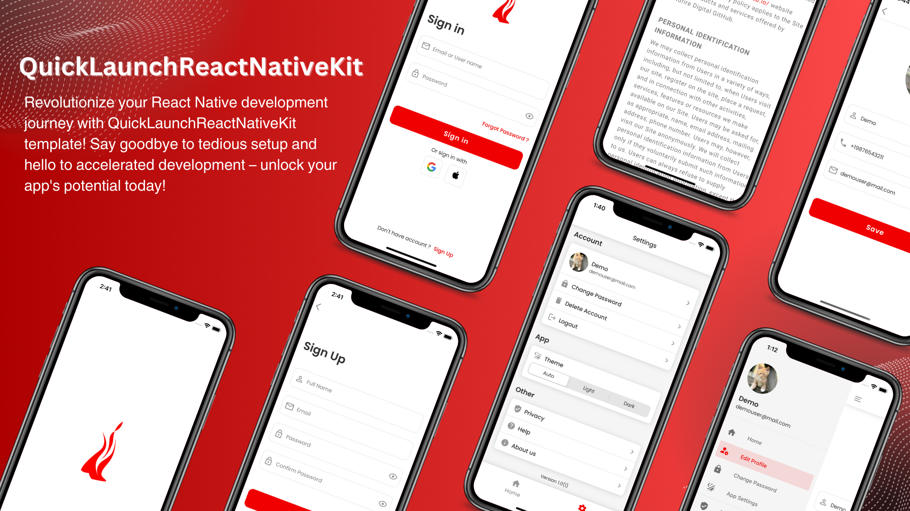

# Quick Launch React Native Kit



## Overview

Welcome to QuickLaunchReactNativeKit! This kit is designed to expedite the development process of common React Native projects by providing pre-built frameworks for essential functionalities like login, signup, settings, and more. With QuickLaunchReactNativeKit, developers can seamlessly integrate these features into their projects, saving valuable time and effort. Additionally, this kit offers multiple themes to enhance the aesthetic appeal of your app.

Your new QuickLaunchReactNativeKit project comes equipped with a comprehensive set of libraries, already configured and ready for use. Here's what's included:

- **React Native**: The foundation for building cross-platform mobile applications.
- **React Navigation**: A powerful library for handling navigation in React Native apps.
- **Redux Toolkit**: A Redux library that simplifies state management.
- **Redux Persist**: Enables seamless persistence of Redux state.
- **TypeScript**: Provides type safety and improved code quality.
- **AsyncStorage**: Allows for asynchronous, persistent storage in React Native apps.
- **axios**: A versatile HTTP client for making requests to REST servers.
- **In-app update**: Facilitates seamless updates to your app within the application itself.
- **Dark and Light mode support**: Enhances user experience by offering multiple color themes.
- **Multi-language support**: Enables localization and internationalization of your app.
- **SVG icons support**: Easily integrate scalable vector graphics into your app.
- **Prebuilt UI**: Accelerates development with pre-designed user interface components.
- **Social sign-ins**: Simplifies user authentication with Google and Apple sign-ins.
- **Additional prebuilt [components](./docs/template/src/components/Components.md)**: Explore a variety of pre-built components to enhance your app's UI.

And much more!

### Example Screens

Utilize our pre-built screens to jumpstart your app development:

1. **Authentication**: Simplify user sign-in, sign-up, and password recovery processes.

2. **Settings**: Customize user preferences effortlessly for a personalized experience and account management.

3. **Navigation**: Seamlessly organize app content with tab and drawer views.

[Explore all available screens](./docs/ScreenShots.md)

With QuickLaunchReactNativeKit, expedite your React Native project and craft exceptional mobile experiences. Happy coding!

## Installation

To get started with QuickLaunchReactNativeKit, follow these steps:

### Prerequisites

- For React Native, make sure you're set up for React Native by following [the official documentation](https://reactnative.dev/docs/environment-setup).
- Ensure you have Node.js LTS release or greater installed.
- Install recent versions of Xcode and Android Studio.
- Recommended: Yarn or npm package manager.
- Recommended: macOS (for iOS development).

### Running the CLI

Get walked through the prompts for the different options to start your new app

```terminal
npx react-native@latest init <ProjectName> --template=https://github.com/mindfiredigital/QuickLaunchReactNativeKit.git#development
```

### Post-Install Setup

#### Step 1: Theme Configuration

During setup, you have the option to customize your theme or choose from preset themes.

##### Option 1: Custom Theme Configuration

1. You'll be prompted to define custom theme values.
2. Follow the prompts to input hex color values for each theme property.
3. Upon completion, a custom theme file will be generated successfully.

##### Option 2: Preset Theme Configuration

1. Select a theme from the available options. Refer to the [Theme Section](./docs/template/src/theme/PresetThemes.md) for details.
2. The chosen theme will be applied to your project.

#### Step 2: Choose Navigation Type

1. Select your preferred navigation type: Tab or Drawer, as per your app's structure. Refer to the [Navigation Types](./docs/template/src/navigation/Navigation.md) section for more information.
2. Navigation type will be set accordingly.

### Project Initialization Complete

Your React Native project has been generated with the QuickLaunchReactNativeKit template. You're now ready to start development with your chosen theme and navigation type configurations. Follow the instructions displayed in the terminal to seamlessly run your app on both iOS and Android platforms.

## Documentation

- [Tech Stack](./docs/template/TechStack.md) - List of the key libraries, tools, and utilities used in the project's tech stack, along with their respective versions and brief descriptions.

- [Folder Structure](./docs/template/FolderStructure.md) - An overview of the project folder structure

- [Components](./docs/template/src/components/Components.md) - QuickLaunchReactNativeKit's built-in UI components.

  - [Button](./docs/template/src/components/Button.md)
  - [Card](./docs/template/src/components/Card.md)
  - [Header](./docs/template/src/components/Header.md)
  - [Icon](./docs/template/src/components/Icon.md)
  - [MenuItem](./docs/template/src/components/MenuItem.md)
  - [OTPTextField](./docs/template/src/components/OTPTextField.md)
  - [Screen](./docs/template/src/components/Screen.md)
  - [Separator](./docs/template/src/components/Separator.md)
  - [Spinner](./docs/template/src/components/Spinner.md)
  - [Text](./docs/template/src/components/Text.md)
  - [TextField](./docs/template/src/components/TextField.md)
  - [WebViewApp](./docs/template/src/components/WebViewApp.md)

- [Theme](./docs/template/src/theme/Theme.md) - How to customize the look and feel of your app

- [Navigation](./docs/template/src/navigation/Navigation.md) - How [React Navigation](https://reactnavigation.org/docs/getting-started/) is used to navigate through your screens
