# Preset Themes

List of available themes:

Here are the tables for each theme with light and dark mode hex color values:

## Theme 1

| Type                | Light                                                                     | Dark                                                                      |
| ------------------- | ------------------------------------------------------------------------- | ------------------------------------------------------------------------- |
| Primary             |  `#AF545B` |  `#AF545B` |
| Text                |  `#333333` |  `#E6E6E6` |
| Background          |  `#FFFFFF` |  `#181D3D` |
| BackgroundSecondary |  `#F5F5F5` |  `#111A2B` |
| Tertiary            |  `#181D3D` |  `#D2D2D2` |
| ButtonTextPrimary   |  `#FFFFFF` |  `#BBC2D8` |
| ButtonTextSecondary |  `#C8C8C8` |  `#AFAFAF` |
| Border              |  `#E6E6E6` |  `#333333` |
| PlaceholderText     |  `#808080` |  `#808080` |
| Card                |  `#FFFFFF` |  `#181D3D` |

#### Screenshots

<table>
  <tr>
    <td>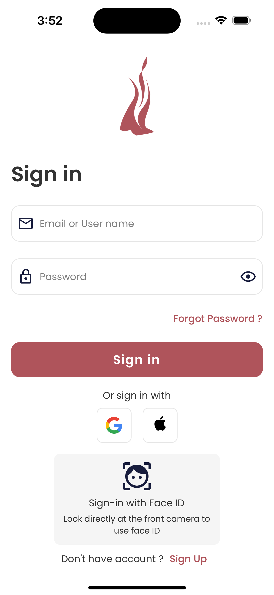</td>
    <td></td>
    <td>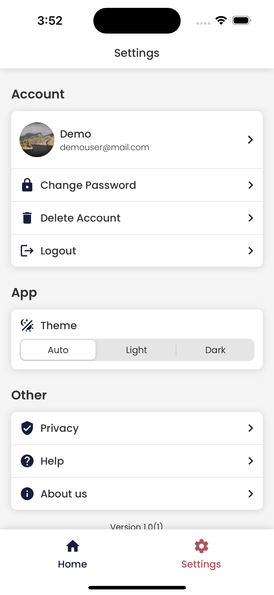</td>
    <td>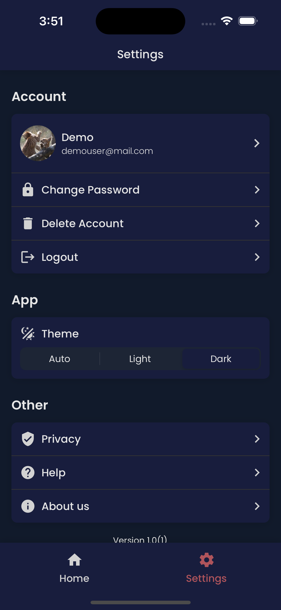</td>
  </tr>
</table>

## Theme 2

| Type                | Light                                                                     | Dark                                                                      |
| ------------------- | ------------------------------------------------------------------------- | ------------------------------------------------------------------------- |
| Primary             |  `#F00001` |  `#F00001` |
| Text                |  `#333333` |  `#E6E6E6` |
| Background          |  `#FFFFFF` |  `#1E1E1E` |
| BackgroundSecondary |  `#F5F5F5` |  `#282828` |
| Tertiary            |  `#999999` |  `#999999` |
| ButtonTextPrimary   |  `#FFFFFF` |  `#FEFFFF` |
| ButtonTextSecondary |  `#C8C8C8` |  `#BBC2D8` |
| Border              |  `#E6E6E6` |  `#333333` |
| PlaceholderText     |  `#808080` |  `#D2D2D2` |
| Card                |  `#FFFFFF` |  `#1E1E1E` |

#### Screenshots

<table>
  <tr>
    <td>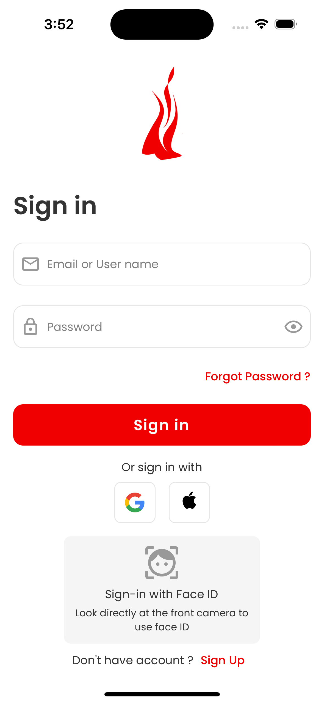</td>
    <td>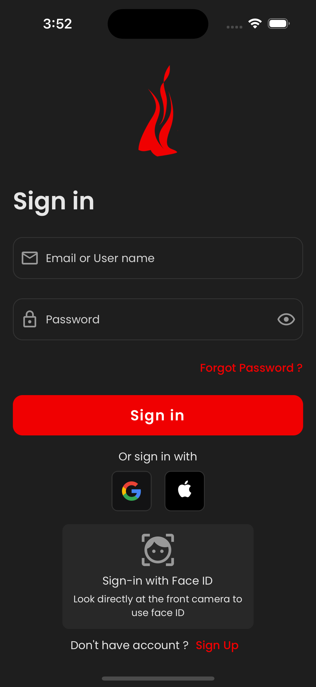</td>
    <td>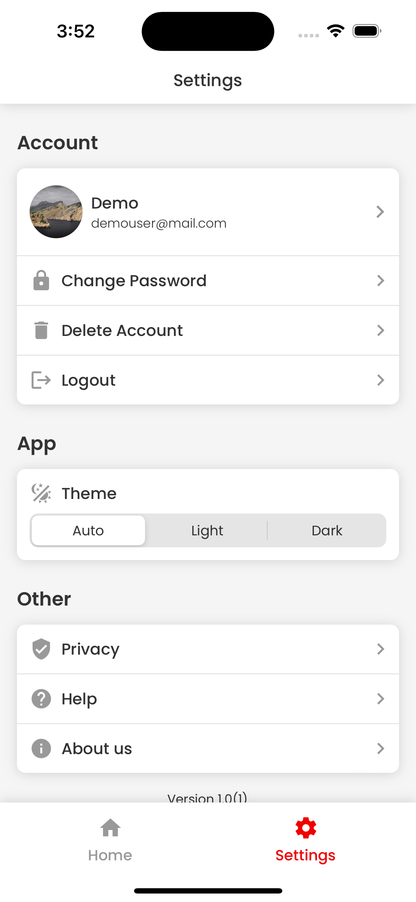</td>
    <td>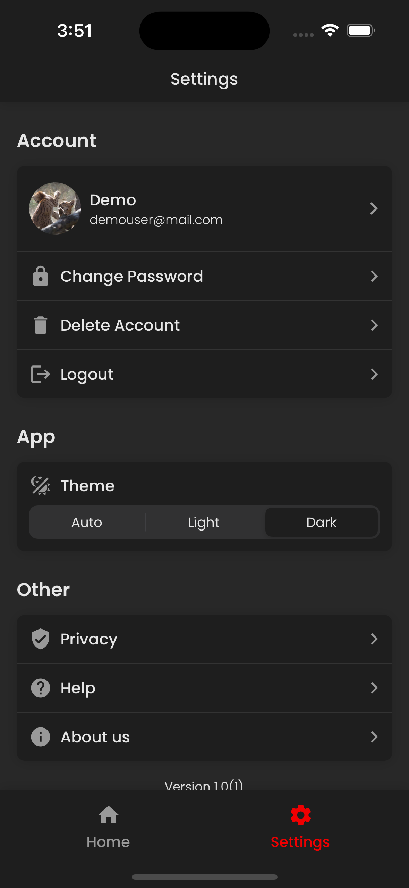</td>
  </tr>
</table>

## Theme 3

| Type                | Light                                                                     | Dark                                                                      |
| ------------------- | ------------------------------------------------------------------------- | ------------------------------------------------------------------------- |
| Primary             |  `#8034DE` |  `#8034DE` |
| Text                |  `#333333` |  `#E6E6E6` |
| Background          |  `#FFFFFF` |  `#1E1E1E` |
| BackgroundSecondary |  `#F5F5F5` |  `#282828` |
| Tertiary            |  `#999999` |  `#999999` |
| ButtonTextPrimary   |  `#FFFFFF` |  `#FEFFFF` |
| ButtonTextSecondary |  `#C8C8C8` |  `#BBC2D8` |
| Border              |  `#E6E6E6` |  `#333333` |
| PlaceholderText     |  `#808080` |  `#D2D2D2` |
| Card                |  `#FFFFFF` |  `#1E1E1E` |

#### Screenshots

<table>
  <tr>
    <td>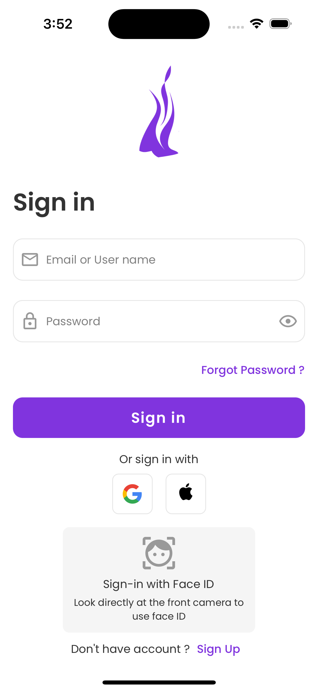</td>
    <td>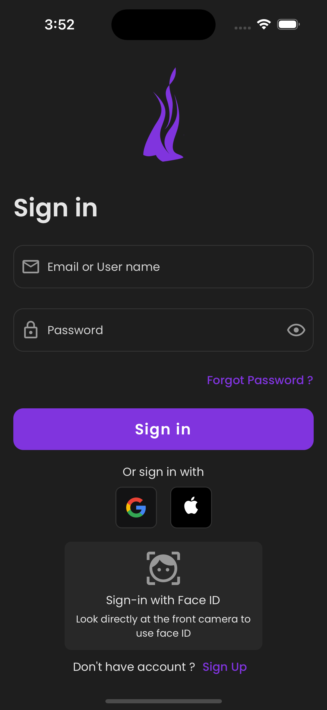</td>
    <td>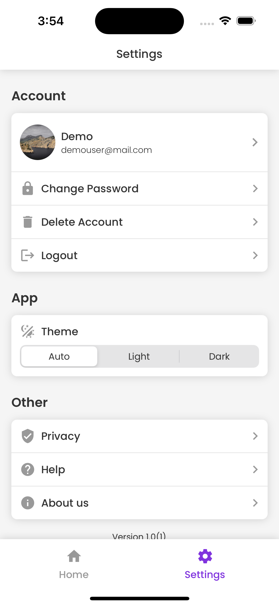</td>
    <td>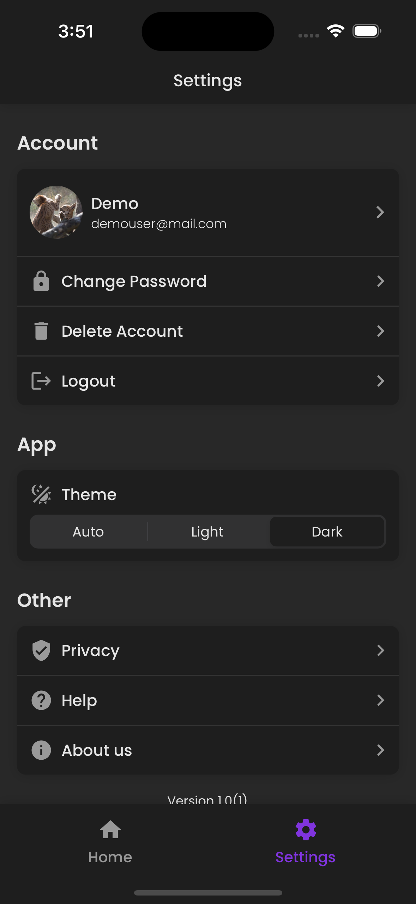</td>
  </tr>
</table>
